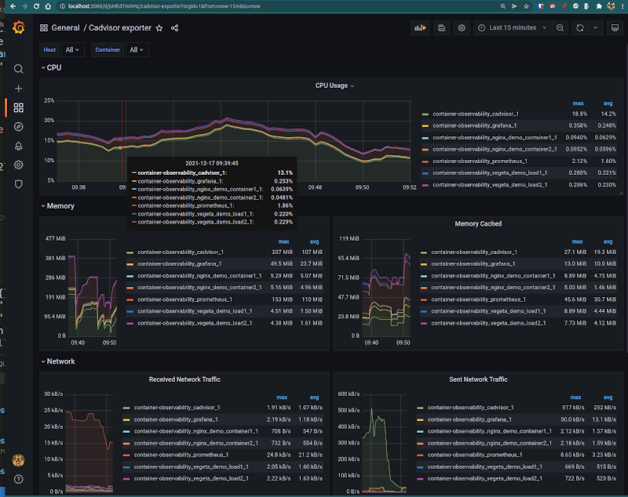

# Enhanced Container Observability


An experiment with [Cadvisor](https://github.com/google/cadvisor), Prometheus, Grafana to give us enhanced and repeatable observability of running containers

- Cadvisor is used to scrape system and docker metrics, it will surface a REST API, prometheus metrics endpoint and it's own rudimentary dashboard
- Prometheus scrapes and stores the data from `cadvisor/metrics`
- Grafana will read data from prometheus and can be used to create dashboards
- We have a bunch of nginx containers as our sample apps and use [vegeta](https://github.com/tsenart/vegeta) load testing tool to put continuous random dummy load onto them so we get nice looking graphs
- Will will also explore custom hand-cranked HTML+JS dashboards that read data from `cadvisor/api`

## Getting started

```bash
docker-compose up
```

This will spin up all the containers.
Then visit Grafana on http://localhost:3000 (usr/pwd: `admin`/`admin`)

### NB

- You can also see cadvisor on http://localhost:8081 and prometheus on https://localhost:9090
- Grafana has a `docker-containers` dashboard pre-configured; see `backend/grafana/provisioning/dashboards/docker-containers.json`
- the vegeta dummy load containers will run continuously and generate some random-ish load; see `backend/dummy_nginx_load.sh`

## Screenshots



## TODO

- [x] setup basic docker-compose setup
- [x] wire up Prometheus to cadvisor
- [x] wire up grafana to prometheus
- [x] create some dummy containers to simulate load
- [x] IAC a grafana dashboard
- [ ] create nginx proxy to wrap cadvisor + webpage to prevent CORS issues
- [ ] create a quick and dirty custom visualisation dashboard
- [ ] create a proper custom dashboard
- [ ] add IAC grafana alerting
- [ ] document memory usage of the stack
- [ ] Add some sample cadvisor container data [metadata "hints"](https://github.com/google/cadvisor/blob/master/container/common/container_hints.go)

## Licence

[MIT](LICENCE)
