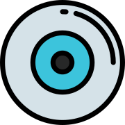

# Enhanced Container Observability

An experiment with [Cadvisor](https://github.com/google/cadvisor), Prometheus, Grafana to give us enhanced and repeatable observability of running containers

## TODO

- [x] setup basic docker-compose setup
- [ ] wire up Prometheus to cadvisor
- [ ] document memory usage of the stack
- [ ] create some dummy containers to simulate load
- [ ] clickops a grafana dashboard
- [ ] IAC a grafana dashboard
- [ ] create nginx proxy to wrap cadvisor + webpage to prevent CORS issues
- [ ] create a quick and dirty visualisation dashboard
- [ ] create a proper dashboard

## Licence

[MIT](LICENCE)